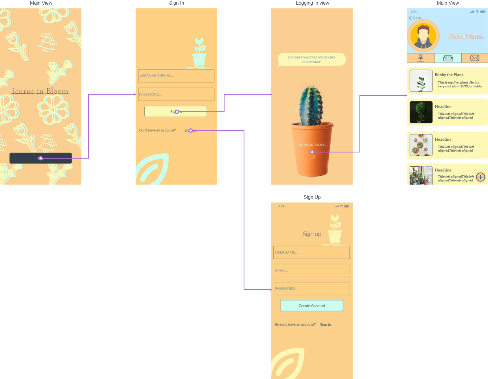

# IcarusInBloom
Android project - Organizational app for plant owners

## _DESCRIPTION_

  "Icarus in Bloom" is a project for an Android app whose **main purpose** is helping plant owners better track the plants they have and their needs. 
  
 The app is meant to have a couple of useful functionalities, such as: a main view of all your plants (including pics, name, and a small description), another view where you can check which plants need watering / change of soil / etc., and _maybe_ a forum with discussions from more plant owners.   

## _MOTIVATION_

  Are there apps like this already? Yes, most probably. But, being the broke college student that I am, paying 5$ for an app like that seems too much so I am making my own.
  
  Also, plants:
  - [x] cute
  - [x] i like them
  - [x] give oxygen
  
 ## _REQUIREMENTS_ 
 
###### MUST have

 1. As a user, I want to create an account so that I can access the functionalities and save my data
 2. As a user, I want to add new plants to the list whenever I buy a new one
 3. As a user, I want to manage the information about my plants at any time
 4. As a user, I want to check if I watered my plants so that I don't forget and overwater them
 5. As a user, I want to note when I need to change the soil and get notified of it
 
 ###### SHOULD have
 
 6. As a user, I want to add my own pictures for the plants' descriptions so that I can further personalize my account
 7. As a user, I want to manage my account information, such as my profile picture, email, etc.
 
 ###### COULD have
 
 8. As a user, I want to get notifications when it is time to water my plants
 9. As a user, I want to customize the look of my app, such as using dark mode
 10. As a user, I want to use the message board and ask plant related question
 
 ###### WON'T have
 
 11. As a user, I want to answer other peoples' comments from the message board, so that I can actively contribute to the group of plant owners
 12. As a user, I want to get daily advices for the type of plants that I have

  ## _FULFILLED REQUIREMENTS_
  
  ###### MUST have

 1. Completed
 2. Completed
 3. Completed
 4. Completed
 5. Changed implementation - now appears with the watering part - Completed
 
 ###### SHOULD have
 
 6. Completed
 7. Completed - picture and name
 
 ###### COULD have
 
 8. Completed - general notification to checkup on plant
 9. Changed implementation - made a general color scheme for both modes, accent colors for dark mode are different though
 10. Changed implementation - third tab now became a diary with posibility to take in app pictures
 
 ###### WON'T have
 
 11. Changed implementation - see requirement no. 10
 12. Not implemented
